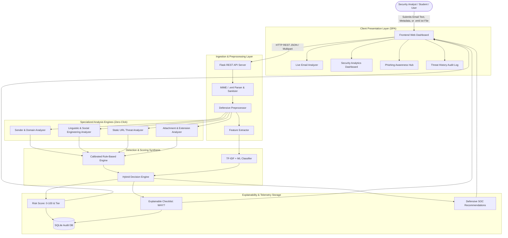

# System Architecture & Technical Specification

## Phishing Email Detection & Awareness Dashboard (SentinelPhish)

### 1. High-Level Architecture Overview

SentinelPhish implements a multi-layered, zero-trust, defense-in-depth architecture designed for automated email triage and security awareness training. The system separates static syntactic parsing, heuristics-driven rule evaluation, NLP feature engineering, probabilistic machine learning inference, and privacy-preserving audit logging.

---

### 2. Detailed Data Flow Description

1. **Email Ingestion**:
   - The user inputs email parameters via the responsive dashboard or uploads an RFC 822 `.eml` / `.txt` file.
   - The input is sanitized using bounded lengths and character normalization to prevent injection attacks or memory exhaustion.

2. **Defensive Preprocessing**:
   - The [`EmailPreprocessor`](file:///backend/services/preprocessor.py) extracts links, display names, domains, and attachment extensions without resolving or querying DNS/IP networks.
   - Punctuation (e.g. `!`), currency markers, and casing are intentionally preserved to detect psychological intimidation and panic indicators.

3. **Multi-Vector Static Analysis**:
   - **Sender Analysis**: Scrutinizes sender syntax, excessive subdomains, domain length, character anomalies, and display name mismatch against prominent corporate brands.
   - **Content Analysis**: Categorizes psychological coercion into Urgency, Fear/Intimidation, Financial Pressure, Direct Credential Harvesting, Baiting/Prizes, and Sensitive PII.
   - **URL Analysis**: Parses URL scheme (HTTP vs HTTPS), detects raw IP addresses (e.g. `198.51.100.10`), identifies link shorteners, and highlights suspicious credential keywords.
   - **Attachment Analysis**: Evaluates file extensions for executables (`.exe`, `.scr`, `.bat`), scripts (`.js`, `.vbs`, `.ps1`), macros (`.docm`, `.xlsm`), and evasion techniques like double extensions (`.pdf.exe`).

4. **Rule & ML Hybrid Scoring**:
   - Deterministic rule weights aggregate known indicators into an evidentiary score (0–100).
   - An NLP classifier evaluates TF-IDF vector representations of the text.
   - The Hybrid Decision Engine synthesizes both scores ($60\%$ rule weight + $40\%$ ML probability) to eliminate single-point-of-failure blind spots.

5. **Explainability & SOP Recommendation**:
   - The engine generates granular bullet points explaining exact point deductions and severity tiers.
   - Contextual SOC operational guidelines are rendered based on which attack vectors were detected.

6. **Privacy-Preserving Telemetry**:
   - The SQLite database logs only analytical metadata (sender domain, sanitized subject, scores, triggered indicators, safe URL representations). Raw email bodies are discarded to respect privacy and confidentiality.
